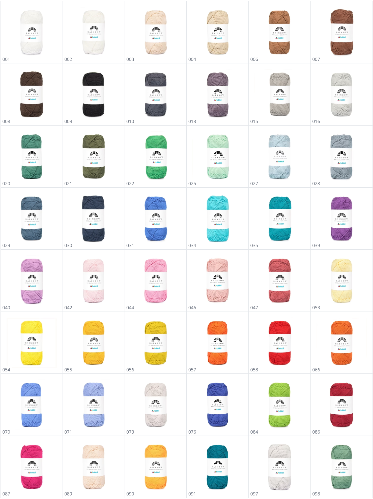

# Colour Matcher

A web-based tool that helps you identify and match colours from images. Perfect for finding part of an image that is closest to specific colour/s.



## Demo

- [index.html](https://theogibbons.github.io/colour-matcher/index.html)

## Features

- **Image Upload**: Upload any image to analyse its colours
- **Colour Extraction**: Draw squares around specific areas to extract their average colours
- **Colour Matching**: Add target colours and find the closest matches in your image
- **Match Percentage**: See how closely your target colours match the extracted colours
- **Average Colour Analysis**: View the average colour across all analysed areas
- **Visual Feedback**: Immediate visual representation of colours and matches

## How to Use

### Main Application (index.html)

1. **Upload an Image**
   - Click the file input to upload an image

2. **Draw Squares Around Colours**
   - Click and drag on the image to draw squares around the colours you want to analyse

3. **Add Colours to Match**
   - Use the colour picker to select colours you want to match

4. **View Results**
   - See all analysed colours in the Results section
   - Each colour shows its hex code and location in the image
   - The best matches are highlighted
   - View the average colour across all analysed squares

### Secondary Tool (colour-average.html)

A simple utility page for calculating the average of multiple colours.

## Technical Details

- Pure HTML, CSS, and JavaScript implementation
- No external dependencies
- Canvas-based image processing
- Colour analysis with RGB and hexadecimal formats

## Installation

Simply clone this repository and open index.html in a web browser:

```bash
git clone https://github.com/yourusername/colour-matcher.git
cd colour-matcher
```

## License

See the [LICENSE](LICENSE) file for details.
